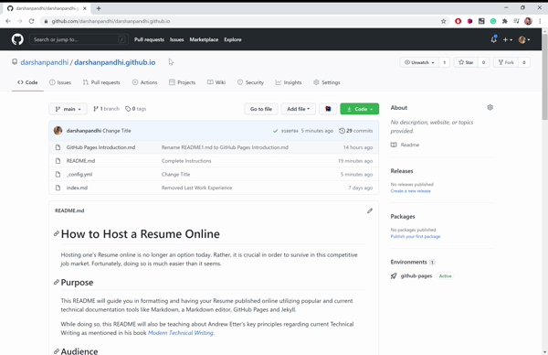

# How to Host a Resume Online

Hosting one's Resume online is no longer an option today. Rather, it is crucial in order to survive in this competitive job market. Fortunately, doing so is much easier than it seems.

## Purpose

This README will guide you in formatting and having your Resume published online utilizing popular and current technical documentation tools like Markdown, a Markdown editor, GitHub Pages and Jekyll.

While doing so, this README will also be teaching about Andrew Etter's key principles regarding current Technical Writing as mentioned in his book [_Modern Technical Writing_](https://www.amazon.ca/Modern-Technical-Writing-Introduction-Documentation-ebook/dp/B01A2QL9SS/).

## Audience

This README is intended for fellow Computer Science Students looking to increase their employability.

## Terminology

The following terms are used throughout the README and hence have been defined here

- [**Markdown**](https://www.markdownguide.org/)

  Markdown is a lightweight markup language. Simply put, it is a way of formatting text documents.

  As a matter of fact, this README itself is formatted in Markdown using a Markdown Editor which brings us to our next term.

- **Markdown Editor**

  Markdown Editors are simple, easy to use text to HTML conversion tools.

  I personally prefer [Visual Studio Code](https://code.visualstudio.com/) as it shows a live preview side by side as you type the corresponding Markdown.

- [**GitHub Pages**](https://pages.github.com/)

  Using GitHub Pages, you can convert your favourite repository into a website

- [**Jekyll:**](https://jekyllrb.com/)

  Jekyll is a static site generator that is used to convert plain text into static websites.

## Prerequisites

- **A Resume formatted in [Markdown](https://www.markdownguide.org/)**
- **A GitHub Account:** If you don't have one already, you can create a free one on the [GitHub Website](https://github.com/join)

## Instructions

### Animated GIF

### Steps to create a new GitHub Repository

1. Sign In / Open your GitHub Repositiory
2. Click on **New / Create Repository** to create a new repository
3. Name this new repositiory as _yourGitHubUsername_.github.io
4. Set it up as a **Public** Repository.
5. Check **Add a README file** to allow GitHub to automatically create a README file for you (like the one you are reading right now)
6. Click **Create repository**

### Steps to upload your Resume to this new Repository

**Reminder:** Your resume should be formatted in [Markdown](https://commonmark.org/help/).

1. Click **Add file** within your new repository.
2. Select **Upload files** from the dropdown box.
3. Rename your Markdown formatted Resume file as index.md.
4. Drag this index.md file into your repository.
5. Enter a commit message.

   **Note:** A commit message is simply a short description of the change in the repository. In this case, we can have it as **Add Resume**.

6. Click **Commit Changes**.

### Steps to create a Static Website for your Resume and style it

We use Jekyll to build our static website for hosting on GitHub Pages. This static website will contain the Resume.

1. Click **Settings** tab from within the repository.
2. Scroll Down to GitHub Pages Section. Here, you will see the URL of your GitHub Page.
3. Click **Choose a theme** under the **Theme Chooser** Sub-Section.
4. Select a desired theme.
5. Click **Select theme**.

And that's all. You have successfully hosted your Resume online. To check that out, just navigate to _yourGitHubUsername_.github.io website.

### More Resources

- [A fun and interactive Markdown Tutorial](https://commonmark.org/help/tutorial/)

- [Modern Technical Writing by Andrew Etter](https://www.amazon.ca/Modern-Technical-Writing-Introduction-Documentation-ebook/dp/B01A2QL9SS/)

- #### \***\*TODO**: at least one other resource

## Authors and Acknowledgements

Fantastic Five - names

## FAQs

1. A question about the overall process, such as “Why is Markdown better than a word processor?”
2. A question about the practical details, such as “Why is my resume not showing up?” You may use the example FAQs, or come up with your own.
